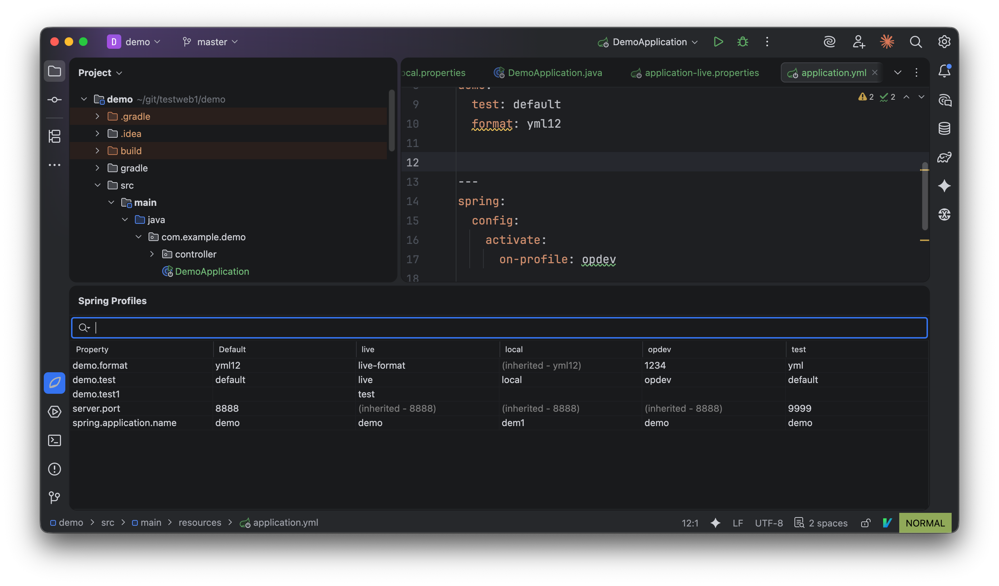
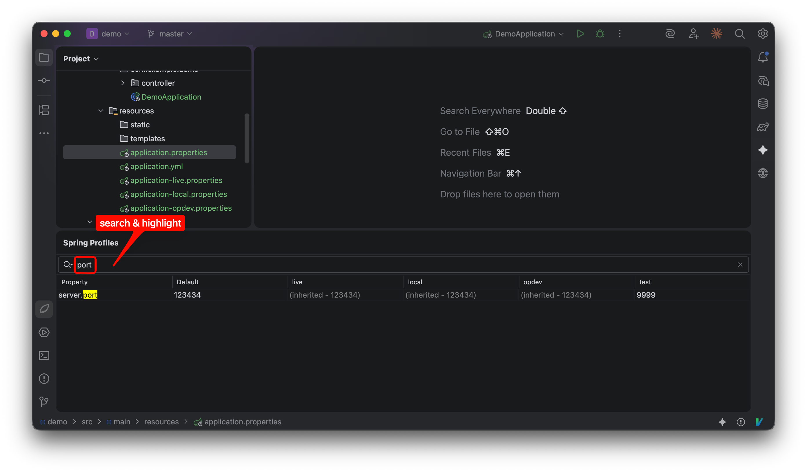
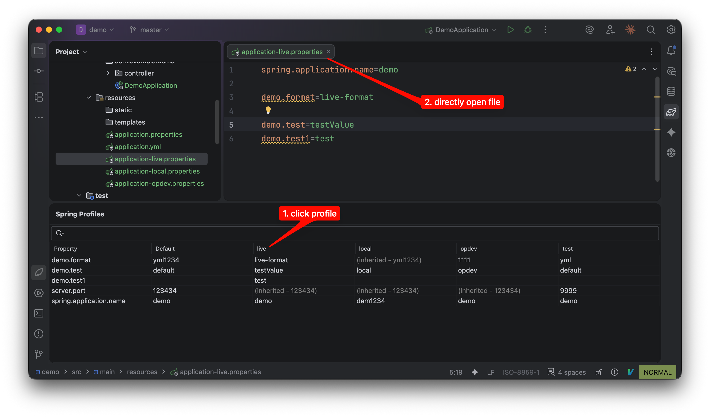
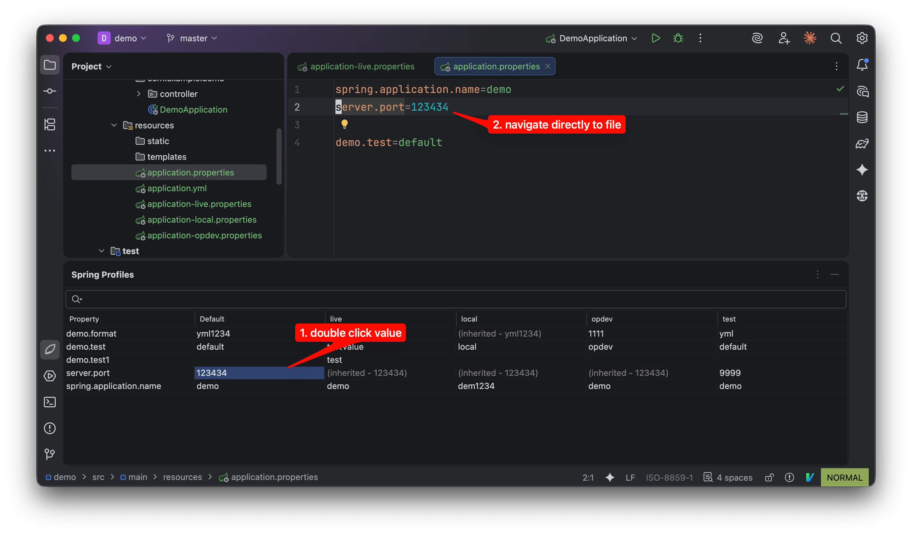
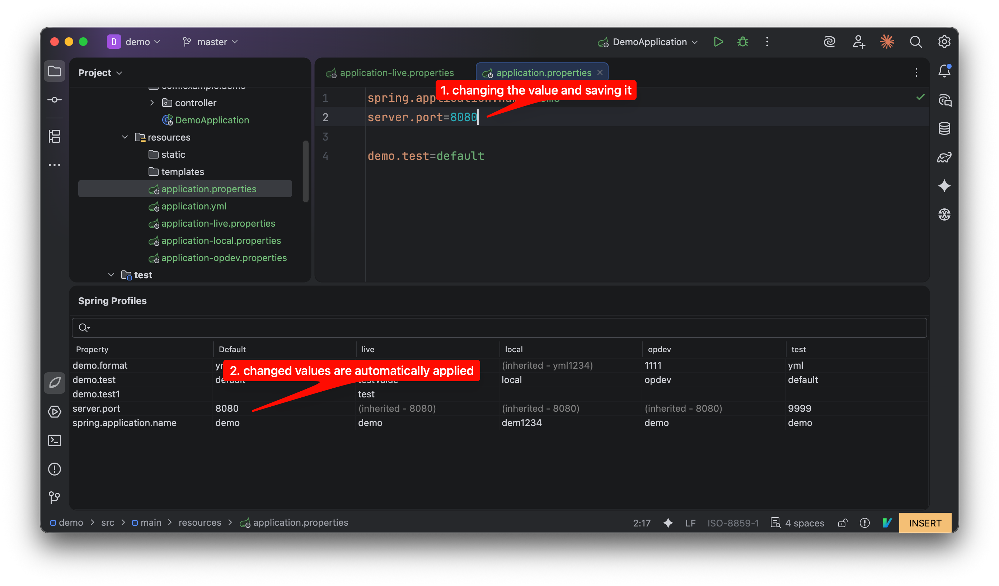

# spring-profile-editor

<!-- Plugin description -->
<h2>Unified Profile Management for Spring Boot</h2>

    Manage Spring Boot configurations across multiple profiles and files within a single, integrated tool window.
    Spring Profile Editor consolidates properties from <code>application.yml</code>, <code>.properties</code>, and multi-document YAML files into a clear grid view.

<h3>Key Features</h3>
<ul>
    <li>
        <b>Consolidated View</b> 
        View and compare properties from all active profiles side-by-side. Columns represent profiles (e.g., default, dev, prod), making profile-specific overrides immediately visible.
    </li>
    <li>
        <b>Source Navigation</b> 
        Double-click any value to navigate directly to its definition in the source file. Click profile headers to open the corresponding configuration file.
    </li>
    <li>
        <b>Profile Filtering</b> 
        Use the "Profiles" dropdown to select/deselect specific profiles or toggle all profiles at once for a focused view.
    </li>
    <li>
        <b>Search & Highlight</b> 
        Filter properties by key or value with real-time highlighting to locate configurations.
    </li>
    <li>
        <b>Context Menu Access</b> 
        Right-click on any <code>.yml</code> or <code>.properties</code> file in the Project View to open the editor instantly.
    </li>
    <li>
        <b>Multi-Module Support</b> 
        Seamlessly switch between modules using the dropdown selector. The editor automatically filters and displays configurations relevant to the selected module.
    </li>
</ul>

<h3>Links</h3>
<ul>
    <li><a href="https://github.com/cinari4/spring-profile-editor-docs/issues">Issue Tracker</a></li>
    <li><a href="https://github.com/cinari4/spring-profile-editor-docs">Documentation</a></li>
</ul>

 

 

<h2>Spring Boot를 위한 통합 프로파일 관리</h2>

    단일 통합 도구 창에서 여러 프로파일과 파일에 걸친 Spring Boot 설정을 관리하세요.
    Spring Profile Editor는 <code>application.yml</code>, <code>.properties</code> 및 멀티 문서 YAML 파일의 속성을 명확한 그리드 뷰로 통합하여 보여줍니다.

<h3>핵심 기능</h3>
<ul>
    <li>
        <b>통합 뷰 (Consolidated View)</b> 
        모든 활성 프로파일의 속성을 한눈에 비교하고 확인할 수 있습니다. 각 열(Column)은 프로파일(예: default, dev, prod)을 나타내며, 프로파일별로 재정의된 값을 쉽게 파악할 수 있습니다.
    </li>
    <li>
        <b>소스 탐색 (Source Navigation)</b> 
        테이블의 값을 더블 클릭하면 소스 파일의 해당 정의로 바로 이동합니다. 프로파일 헤더를 클릭하면 해당 설정 파일이 열립니다.
    </li>
    <li>
        <b>프로파일 필터링 (Profile Filtering)</b> 
        "Profiles" 드롭다운을 통해 특정 프로파일만 선택해서 보거나, "All" 옵션으로 전체를 한 번에 선택/해제할 수 있습니다.
    </li>
    <li>
        <b>검색 및 강조 (Search & Highlight)</b> 
        키워드로 속성을 실시간 검색하고 하이라이트 기능을 통해 원하는 설정을 빠르게 찾을 수 있습니다.
    </li>
    <li>
        <b>컨텍스트 메뉴 지원 (ContextMenu Access)</b> 
        Project View에서 <code>.yml</code> 또는 <code>.properties</code> 파일을 우클릭하여 플러그인을 즉시 실행할 수 있습니다.
    </li>
    <li>
        <b>멀티 모듈 지원 (Multi-Module Support)</b> 
        드롭다운 선택기를 통해 모듈 간을 원활하게 전환할 수 있습니다. 에디터는 선택된 모듈과 관련된 설정만 자동으로 필터링하여 표시합니다.
    </li>
</ul>

<h3>링크</h3>
<ul>
    <li><a href="https://github.com/cinari4/spring-profile-editor-docs/issues">이슈 트래커</a></li>
    <li><a href="https://github.com/cinari4/spring-profile-editor-docs">문서</a></li>
</ul>

<h2>Screenshots / 스크린샷</h2>

  
   
  Plugin Overview
   
  플러그인 이미지

  
   
  Search and highlight capability
   
  검색과 하이라이트 가능

  
   
  Open profile file by clicking the profile header
   
  프로파일을 클릭했을 때, 해당 프로파일을 연다

  
   
  Navigate to code location by selecting a value
   
  프로파일의 값을 선택했을 때, 바로 코드상의 위치로 이동

  
   
  Real-time reflection of changes when profile values are modified and saved
   
  프로파일의 값을 수정하고 저장했을 때, 바로 플러그인에 변경사항 반영

<!-- Plugin description end -->
